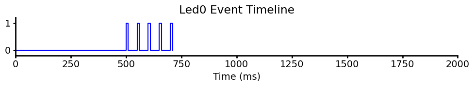

# Docs
- Use Jupyter notebook to design stimulus schedules
- copy to microSD card for Teensy
- When server starts a trial, the led_driver Teensy plays every channel's schedule from a shared trial clock and reports each output change back to the server.
- If the connection drops, the Teensy turns all LEDs off and opens the shutter

Example LED schedule:

# Reqs
- Teensy 4.1 with the Ethernet kit and a microSD card. LED drivers go on pins 2–4 and the shutter on pin 5.
- [WebSockets_Generic](https://github.com/khoih-prog/WebSockets_Generic) and NativeEthernet libraries. Set `WS_HOST` and `WS_PORT` in `led_driver.ino`, then upload.

# Repo structure
- `led_driver/*`: Teensy code with WS client and trial state machine, SD card loader
- `make_event_array_files.ipynb`: Schedule generator
- `arduino_sd_cards/card_test/`: Example generated schedules
- `utils/graphics.py`: graphics settings

# Networking

| Message | Meaning |
|---|---|
`a` | Start session (LEDs off, shutter open) |
`q` | Start trial (all schedules restart at t = 0) |
`k` | Stop session |
`e` | Connected |
`i` + 4 chars | Output state, sent on every change, in the order shutter, led0, led1, led2. `3` means open or on, `2` means closed or off |

